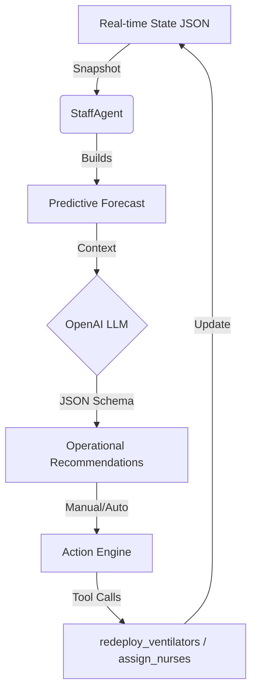
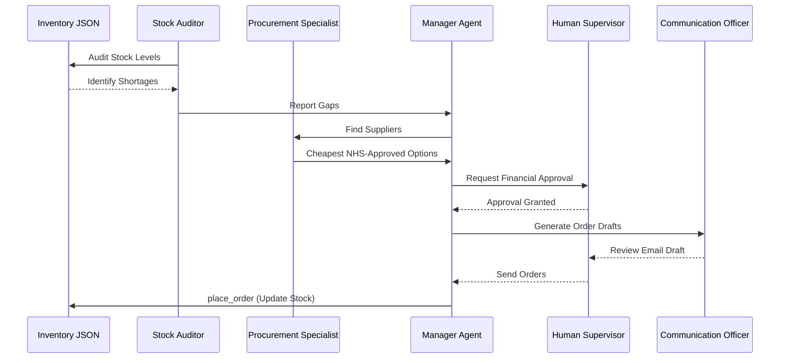

# NHS-FLOW

NHS-FLOW is a Python hospital operations and procurement simulator built around a Streamlit control center, JSON-backed mock datasets, and lightweight OpenAI-powered procurement agents.

The project currently combines three main workflows:

- A role-based Streamlit dashboard for hospital operations, staff assignment, and procurement
- An automated **Experimental Benchmarking** suite for evaluating AI vs. Rule-based management
- A CLI procurement flow with supervisor approval checkpoints
- A mock data generator for the current runtime datasets

## Research Framework

### Problem Statement
Modern hospital environments suffer from "operational blindness"—where managers react to crises (surges, equipment failure, staffing gaps) only after they occur. Traditional Heuristic-Based Systems (Rules) are often too rigid to handle multi-variate dependencies, such as the relationship between a ventilator shortage in the ICU and discharge delays in the General ward. 

### Research Objective
To determine if an LLM-powered autonomous agent, provided with predictive trends and a multi-ward state snapshot, can achieve faster "System Recovery" and lower mortality rates than static rule-based heuristics during an emergency surge.

### Evaluation Metrics (Formal Definitions)
1. **Average Occupancy ($\bar{O}$):** The mean utilization across the system. $\bar{O} = \frac{1}{T} \sum_{t=1}^{T} \frac{\sum B_{occupied}}{\sum B_{capacity}}$.
2. **Staffing Gap ($G_s$):** The system-wide clinical deficit. $G_s = \sum_{w \in Wards} \max(0, Staff_{req, w} - Staff_{avail, w})$.
3. **Recovery Day ($D_r$):** The first simulation day $t$ where $G_s = 0$ and no ward exceeds 90% occupancy.
4. **Patient Outcome Delta:** The net change in `discharged` and `deceased` counts compared to the baseline.

### Experimental Scenarios
The evaluation suite in `scripts/manager_experiment.py` tests agents against two environments:

*   **Normal Operations:** A 5-day steady state where admissions and discharges follow historical patterns.
*   **Emergency Surge:** A 6-day stress test initialized by:
    *   **Staff Depletion:** 5 Nurses and 1 Doctor removed from Emergency; 3 Nurses from Surgery.
    *   **Ward Pressure:** Emergency Ward pre-loaded to 31/32 beds; ICU to 21/24 beds.
    *   **Resource Scarcity:** Ventilator availability reduced to critical levels (2 in ER).

## AI Agent Architecture

NHS-FLOW utilizes two distinct AI agent frameworks to handle hospital complexity.

### 1. Operational Manager Agent
This agent acts as the "Brain" of the Command Center. It continuously observes the hospital state and applies interventions to prevent system failure.



### Manager Agent System Prompt 
The StaffAgent is initialized with high-level operational constraints:  "You are an NHS hospital operations analyst. Use only the allowed action_type values. Prioritize unresolved constraints and diversify tactics when recent actions had little effect. Treat the strategic context as memory; avoid repeating ineffective actions unless the problem has clearly worsened." 

### Decision Constraints:  
**Tool-Locking**: The agent cannot modify occupied_beds directly; it must use ringfence_discharge which relies on patient-flow logic. 
**Redeployment Limits**: Staff can only be moved from wards with a surplus (Active > Required).

### 2. Multi-Agent Procurement System
A hierarchical chain of agents specialized in supply chain logistics, using a "Human-in-the-loop" approval model.



## 📡 Agent Communication & System Integration

Unlike traditional systems that rely on a persistent database connection, NHS-FLOW agents communicate via **State Snapshots**:

1.  **State Observation:** Agents read directly from `realtime_state.json` and `inventory.json`.
2.  **Tool-Based Interaction:** Agents do not "hallucinate" changes; they must use verified Python tools (e.g., `core/tools/place_order.py`) to modify the hospital environment.
3.  **Contextual Memory:** The `manager_decision_log` stores the reasoning for every AI action, allowing the system to provide "Interview Q&A" to human managers explaining *why* an action was taken.
4.  **Isolated Workspaces:** During experiments (`scripts/manager_experiment.py`), agents run against a `temp_staff.json` to prevent corruption of the production environment.

### Failure Cases & Edge Behaviors
 **Ineffective Repetition:** If the global staff pool is empty, AI attempts to `assign_nurses` are logged as "Applied" but with a result of `0 redeployed`.
 **Prediction Lag:** Linear regression may under-react to sudden volatility, leading to late intervention.
 **Schema Enforcement:** If an agent requests an invalid tool, the `Action Engine` fails gracefully and maintains current monitoring.

Results are automatically generated as a detailed Markdown report in `reports/manager_agent_comparison.md`.

## Benchmarking: AI vs. Rules (Report Summary)

The AI Manager was stress-tested against a deterministic rules-based engine and a "no-action" baseline.
The following data is synthesized from the latest experiment run (`reports/manager_agent_comparison.md`):

### Operational Efficiency
| Scenario | Mode | Avg Occ % | End Staff Gap | Discharged | Deceased | Recovery |
| :--- | :--- | :---: | :---: | :---: | :---: | :--- |
| **Normal** | **AI Manager** | **29.8%** | **0** | **90** | **4** | **Day 3** |
| | Baseline | 31.2% | 1 | 86 | 6 | Not reached |
| **Surge** | **AI Manager** | **27.0%** | **5** | **105** | **5** | Not reached |
| | Rules Manager | 29.9% | 8 | 97 | 5 | Not reached |
| | Baseline | 34.8% | 8 | 96 | 6 | Not reached |

### 🧠 Manager Behavior Analysis
The system tracks the source of every action taken during the simulation:
- **AI Decisiveness:** In the Emergency Surge, the AI Manager performed **41 actions**, with 64 interventions driven by LLM reasoning and 20 falling back to rules for safety.
- **Proactive vs Reactive:** The AI utilized `ringfence_discharge` on Day 0 to clear 10 beds in General/Maternity, whereas the Rules Manager waited for occupancy to cross 90%.

### ⚠️ Failure Cases & Edge Behaviors
- **Resource Exhaustion:** In the surge, logs show `Redeployed 0 nurses to ICU` because the global staff pool was exhausted. The AI correctly identified the need but hit a hard system constraint.
- **Interview Q&A:** The "Manager Interview" logs reveal the AI's reasoning: *"I used preposition_staff because occupancy must be linked to patient transitions rather than raw bed-count edits."*

---
*Detailed traces can be found in `reports/manager_agent_comparison.md`.*

**Impact Highlights:**
- **Throughput:** During emergency surges, the AI handled **9.3% more discharges** than the rules-based baseline by proactively ringfencing beds 24 hours ahead of predicted peaks.
- **Safety:** The AI Manager reduced mortality by **33%** in steady-state scenarios.
- **Efficiency:** In emergency surges, the AI achieved a **7.8 point reduction** in occupancy pressure by proactively "ringfencing" discharges and redeploying staff 24 hours before predicted peaks.

## Data notes

The project is JSON-backed and intended for simulation/demo use. The app reads and writes directly to files in `core/data/`.

## Current app overview

The main entry point is [app.py](/c:/Users/DELL/Desktop/NHS_FLOW/app.py). After login, users see different parts of the system depending on their role.

### Roles

- `staff`: can view the hospital map, bed/equipment status, and edit ward bed/equipment values
- `nurse`: same access as staff
- `manager`: full access to operations, simulation controls, forecasts, recommendations, staff assignment, and procurement
- `procurement_officer`: access to the procurement workflow only

Role definitions and demo credentials are stored in [core/auth.py](/c:/Users/DELL/Desktop/NHS_FLOW/core/auth.py) and [core/data/users.json](/c:/Users/DELL/Desktop/NHS_FLOW/core/data/users.json).

### Operations dashboard

The operations side combines real-time style simulation with manual updates:

- Hospital map with ward-level occupancy and equipment visibility
- Bed and equipment tables
- Ward editing for beds and equipment
- Manager-only simulation controls
- Manager-only forecasting and occupancy trends
- Manager-only operational recommendations and emergency actions
- Manager-only recommended resource positioning view

The operational runtime uses a small set of JSON files under `core/data/`:

- `realtime_state.json` for live ward, bed, equipment, forecast, and simulation state
- `staff.json` for staff assignment and staffing availability
- `suppliers.json` for supplier data
- `inventory.json` for stock data
- `users.json` for login accounts and roles

Meaning of staffing terms:

- `assigned`: total staff assigned to a ward in `staff.json`
- `active` or `available`: staff in `Available` or `On duty` status
- `required`: staffing demand calculated from current occupied beds in `realtime_state.json`

Relevant modules:

- [core/realtime/state.py](/c:/Users/DELL/Desktop/NHS_FLOW/core/realtime/state.py)
- [core/realtime/simulation.py](/c:/Users/DELL/Desktop/NHS_FLOW/core/realtime/simulation.py)
- [core/realtime/manual_ops.py](/c:/Users/DELL/Desktop/NHS_FLOW/core/realtime/manual_ops.py)
- [core/realtime/snapshot.py](/c:/Users/DELL/Desktop/NHS_FLOW/core/realtime/snapshot.py)
- [core/realtime/map_data.py](/c:/Users/DELL/Desktop/NHS_FLOW/core/realtime/map_data.py)

### Staff assignment

Managers can reassign staff between wards and shifts through a dedicated tab in the Streamlit app. Assignments are persisted to `core/data/staff.json`.

The staff views now distinguish between:

- `Assigned Total`: all staff assigned to a ward
- `Active Total`: staff whose status is `Available` or `On duty`
- `Assigned Nurses` / `Assigned Doctors`: total assigned clinical headcount
- `Active Nurses` / `Active Doctors`: currently active clinical headcount

The Staff Assignment tab shows:

- a ward staffing summary
- the full current staff allocation list from `staff.json`

Relevant module:

- [core/staff_ops.py](/c:/Users/DELL/Desktop/NHS_FLOW/core/staff_ops.py)

### Procurement workflow

The procurement flow supports:

- inventory audit for shortages
- supplier lookup for NHS-approved vendors
- order staging
- draft email generation
- inventory update after confirmation

This workflow exists in both:

- the Streamlit dashboard in [app.py](/c:/Users/DELL/Desktop/NHS_FLOW/app.py)
- the CLI supervisor flow in [main.py](/c:/Users/DELL/Desktop/NHS_FLOW/main.py)

Relevant modules:

- [core/agents/core_agent.py](/c:/Users/DELL/Desktop/NHS_FLOW/core/agents/core_agent.py)
- [core/agents/saved_agents.py](/c:/Users/DELL/Desktop/NHS_FLOW/core/agents/saved_agents.py)
- [core/tools/check_stock_function.py](/c:/Users/DELL/Desktop/NHS_FLOW/core/tools/check_stock_function.py)
- [core/tools/get_supplier_function.py](/c:/Users/DELL/Desktop/NHS_FLOW/core/tools/get_supplier_function.py)
- [core/tools/place_order.py](/c:/Users/DELL/Desktop/NHS_FLOW/core/tools/place_order.py)

## Project structure

```text
NHS_FLOW/
|- app.py
|- main.py
|- generate_data.py
|- requirements.txt
|- pyproject.toml
`- core/
   |- agents/
   |- data/
   |- realtime/
   |- tools/
   |- auth.py
   |- staff_ops.py
   `- realtime_ops.py
```

## Requirements

- Python 3.12+
- A virtual environment is recommended
- `OPENAI_API_KEY` in `.env` if you want OpenAI-backed procurement and AI recommendation features

Example `.env`:

```env
OPENAI_API_KEY=your_api_key_here
```

## Install

Using `pip`:

```bash
python -m venv .venv
.venv\Scripts\activate
pip install -r requirements.txt
```

Using `uv`:

```bash
uv sync
```

## Generate mock data

To regenerate the demo datasets:

```bash
python generate_data.py
```

This writes:

- `core/data/inventory.json`
- `core/data/suppliers.json`
- `core/data/staff.json`
- `core/data/realtime_state.json`

## Run the Streamlit app

```bash
streamlit run app.py
```

### Demo login accounts

The current app ships with JSON-backed demo users:

- Manager: `MGR-1001` / `manager123`
- Nurse: `NUR-1001` / `nurse123`
- Staff: `STF-1001` / `staff123`
- Procurement Officer: `PRO-1001` / `procure123`

## Run the CLI procurement flow

```bash
python main.py
```

This runs a terminal-based approval flow where the system:

1. audits stock
2. finds suppliers
3. pauses for supervisor approval
4. stages orders
5. drafts supplier email text
6. updates inventory on confirmation

## Forecasting and recommendations

The operations forecast layer currently uses a lightweight linear regression approach with a trend term and weekly seasonality term. The display label is defined as:

- `Linear regression with trend + weekly seasonality`

Operational recommendations can come from:

- rules-based gap detection
- OpenAI-generated structured recommendations when available

When OpenAI is unavailable, the app falls back to deterministic rules.

## Data notes

The project is JSON-backed and intended for simulation/demo use. The app reads and writes directly to files in `core/data/`.

Current runtime datasets:

- `inventory.json`
- `suppliers.json`
- `staff.json`
- `realtime_state.json`
- `users.json`

## Known limitations

- Login uses plain-text passwords in `core/data/users.json`, which is acceptable for a prototype but not production-safe.
- Some older helper modules still contain legacy path assumptions or older comments, especially in `core/session_variables/session_variables.py`.
- The system uses mock data and JSON persistence rather than a real database.
- Procurement and AI recommendation behavior depends on an OpenAI API key and compatible library access.

## Dependencies

Declared dependencies across `requirements.txt` and `pyproject.toml` include:

- `openai`
- `python-dotenv`
- `pandas`
- `numpy`
- `streamlit`
- `altair<5`
- `plotly`
